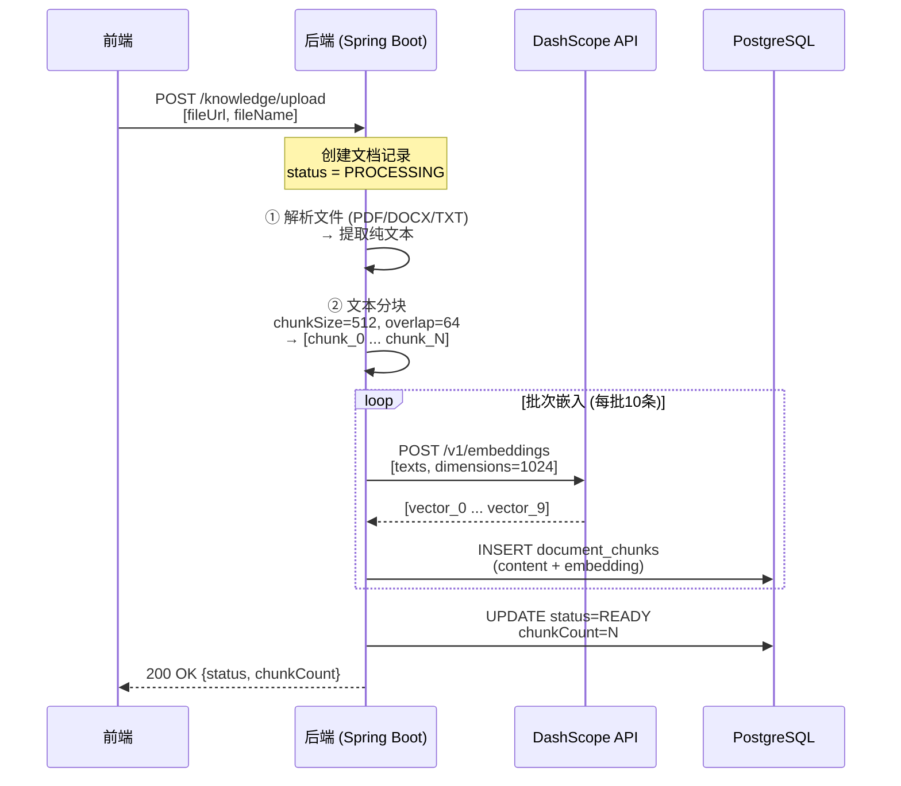
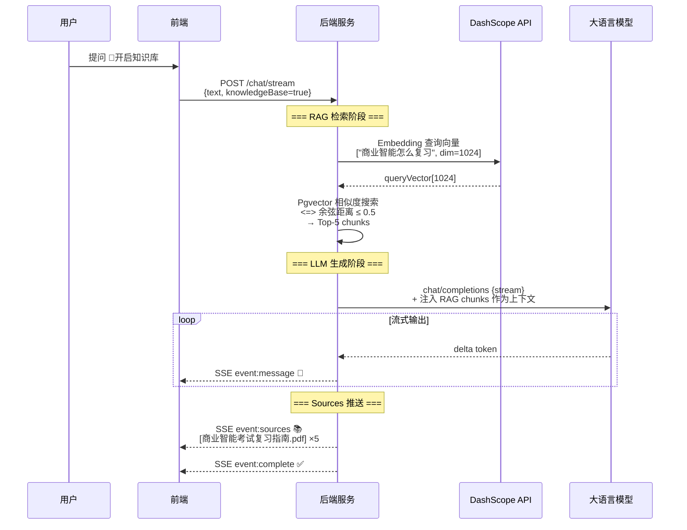

# 知识库检索增强生成（RAG）功能技术文档

## 术语表

在阅读本文档前，请先了解以下 RAG 领域的核心概念：

| 术语 | 英文全称 | 一句话解释 | 类比理解 |
|------|---------|-----------|---------|
| **RAG** | Retrieval-Augmented Generation | 检索增强生成——先搜索知识库，再把找到的内容喂给 AI 回答 | 像考试时"先翻书查资料，再答题" |
| **Embedding / 嵌入向量** | Embedding Vector | 将文本转换为高维数值数组，语义相近的文本在空间中距离更近 | 把文字变成坐标点，意思相近的点聚在一起 |
| **向量数据库** | Vector Database | 专门存储和检索高维向量的数据库，支持相似度计算 | 像"语义版 Google"，搜的是意思不是关键词 |
| **Pgvector** | PostgreSQL Vector Extension | PostgreSQL 的向量扩展插件，让关系型数据库具备向量检索能力 | 给 MySQL 装了个"语义搜索外挂" |
| **余弦相似度** | Cosine Similarity | 衡量两个向量方向一致性的指标，值域 [0,1]，越接近 1 越相似 | 两根箭头指向越接近，夹角越小 |
| **余弦距离** | Cosine Distance | `1 - 余弦相似度`，值域 [0,1]，越接近 0 越相似 | Pgvector 用这个做 `<=>` 运算 |
| **Text Chunking / 文本分块** | Text Chunking | 将长文档切分成固定大小的片段，便于嵌入和检索 | 把一本厚书撕成每页一页的小册子 |
| **Token** | Token | LLM 处理文本的最小单位，中文约 1-2 字 = 1 token | AI 的"字数统计单位" |
| **Top-K** | Top-K Retrieval | 从检索结果中取相似度最高的 K 条记录 | "给我找最相关的 5 条结果" |
| **ETL Pipeline** | Extract-Transform-Load | 数据处理管道：抽取→转换→加载的自动化流程 | 工厂的流水线：原料→加工→成品 |
| **LLM / 大语言模型** | Large Language Model | 基于深度学习的文本生成模型（如 GPT、DeepSeek） | 一个读过海量书的"超级聊天机器人" |
| **SSE** | Server-Sent Events | 服务器单向推送技术，用于流式传输数据 | 像直播弹幕一样，服务端实时推送内容 |
| **LangChain4j** | LangChain for Java | Java 版 LLM 应用开发框架，提供 RAG、Agent 等能力封装 | "AI 开发工具箱"，不用从零写底层逻辑 |
| **ContentRetriever** | Content Retriever | LangChain4j 的内容检索接口，自动将检索结果注入 AI 对话上下文 | AI 的"图书管理员助手"，自动帮它查资料 |
| **Lazy Loading / 懒加载** | Lazy Initialization | Hibernate 延迟加载策略：访问关联对象时才查询数据库 | "按需查资料"，不主动问就不去查 |
| **Eager Loading / 急加载** | Eager Fetch | Hibernate 即时加载策略：查询主对象时一并加载关联对象 | "一次把所有相关资料都带上" |
| **IVFFlat Index** | Inverted File Flat | Pgvector 的近似最近邻索引，通过聚类加速搜索 | 先按区域粗筛，再精确比对，类似"分区查找" |
| **HNSW Index** | Hierarchical Navigable Small World | 更高级的向量索引，基于图结构，精度和速度更优 | 像"社交网络图谱"，通过熟人链快速找到目标 |
| **DashScope** | DashScope (阿里云) | 阿里云的模型服务平台，提供 embedding 和 chat 模型 API | 阿里的"AI 能力商店" |
| **text-embedding-v3** | Text Embedding Model v3 | DashScope 提供的文本嵌入模型，输出 1024 维向量 | "文字→数字"的翻译官 |
| **Hibernate Vector** | Hibernate ORM Vector Module | Hibernate 的向量类型扩展模块，实现 JPA 到 vector 类型的映射 | JPA 和向量数据库之间的"翻译器" |
| **Flyway** | Flyway Migration | 数据库版本管理工具，通过 SQL 脚本管理 schema 变更 | 数据库的"Git"，跟踪每次表结构修改 |
| **BM25** | BM25 Algorithm | 经典的关键词匹配算法，基于词频和文档频率打分 | 传统搜索引擎用的"关键词计分法" |
| **Rerank Model** | Rerank / Cross-Encoder | 对初步检索结果进行精排的模型，提升排序准确性 | 初筛后的"人工复核员" |

---

## 一、功能概述

### 1.1 目标
为 Astra-Studio AI 助手添加知识库（Knowledge Base）能力，支持用户上传文档后，AI 在回答时能自动检索相关知识库内容并引用回答，提升专业领域问答的准确性和可追溯性。

### 1.2 核心能力
- **文档上传与解析**：支持 PDF/DOCX/TXT 等格式，自动解析、分块、向量化存储
- **向量检索**：基于 Pgvector 的余弦相似度搜索，快速定位相关文档片段
- **RAG 增强**：将检索结果注入 LLM 上下文，生成带引用的回答
- **来源追溯**：前端展示参考文档来源，用户可点击查看原文

---

## 二、技术架构

### 2.1 整体架构图

```
┌─────────────────────────────────────────────────────────────────┐
│                        前端 (Vue 3)                             │
│  ┌──────────┐   ┌──────────────┐   ┌─────────────────────────┐ │
│  │ 上传组件  │──▶│ 知识库开关    │──▶│ 来源展示 (Sources)      │ │
│  └──────────┘   └──────────────┘   └─────────────────────────┘ │
└───────────────────────────────┬─────────────────────────────────┘
                                │ SSE / REST API
                                ▼
┌─────────────────────────────────────────────────────────────────┐
│                     后端 (Spring Boot)                           │
│                                                                 │
│  ┌─────────────┐    ┌──────────────┐    ┌──────────────────┐   │
│  │ AiController │───▶│ KnowledgeSvc │───▶│ DocumentETLPipe  │   │
│  └─────────────┘    └──────────────┘    └────────┬─────────┘   │
│         │                                        │             │
│         ▼                                        ▼             │
│  ┌─────────────┐    ┌──────────────┐    ┌──────────────────┐   │
│  │  ChatService │◀───│ RAGRetrieve  │◀───│ EmbeddingModel   │   │
│  │              │    │    Service    │    │ (DashScope v3)   │   │
│  └─────────────┘    └──────┬───────┘    └──────────────────┘   │
│                            │                                   │
│                            ▼                                   │
│                   ┌──────────────────┐                         │
│                   │ ContentRetriever │ (LangChain4j 集成)     │
│                   └────────┬─────────┘                         │
│                            ▼                                   │
│  ┌─────────────────────────────────────────────────────────┐   │
│  │              PostgreSQL + Pgvector                      │   │
│  │  knowledge_documents | document_chunks (embedding)       │   │
│  └─────────────────────────────────────────────────────────┘   │
└─────────────────────────────────────────────────────────────────┘
```

### 2.2 核心数据流

```
1. 用户上传文档 → ETL Pipeline → 解析/分块/向量化 → 存入 PostgreSQL
2. 用户提问（开启知识库）→ Embedding 查询 → Pgvector 相似度搜索 → Top-K chunks
3. Chunks 注入 LLM 上下文 → AI 生成带引用的回答 → SSE 推送 sources 事件给前端
```

### 2.3 核心交互时序图

#### 时序图一：文档上传 ETL 流程



#### 时序图二：知识库问答 RAG 检索流程



### 2.4 技术选型

| 组件 | 技术方案 | 说明 |
|------|---------|------|
| 向量数据库 | **PostgreSQL + Pgvector** | 无需额外服务，利用现有 PG 实例 |
| 向量维度 | **1024** | DashScope text-embedding-v3 支持的最大维度 |
| 嵌入模型 | **text-embedding-v3** (DashScope) | 兼容 OpenAI API，中文效果好 |
| 向量索引 | **IVFFlat** (Pgvector 内置) | 适合中小规模数据集 |
| 分块策略 | **固定长度 512 tokens, 重叠 64** | 平衡语义完整性和精度 |
| 相似度算法 | **余弦距离 (<=)** | Pgvector `<=>` 操作符 |
| JPA 映射 | **Hibernate Vector (hibernate-vector)** | 原生 float[] → vector 类型映射 |
| 缓存层 | **ConcurrentHashMap (TTL 30s)** | 同一请求内避免重复 embedding 调用 |

---

## 三、核心模块设计

### 3.1 文档 ETL 管道 (`DocumentETLPipeline`)

**职责**：接收上传的文件 URL，完成解析→分块→向量化→存储的全流程。

**关键设计决策**：
- **同步执行**（非异步）：确保嵌入完成后才标记文档为 READY 状态
- **批次大小 = 10**：DashScope API 限制每批最多 10 条文本
- **失败即抛异常**：不再保存 NULL embedding，避免脏数据污染数据库

```java
// 核心流程伪代码
processDocument(fileUrl, fileName):
  1. 创建 KnowledgeDocumentEntity (status=PROCESSING)
  2. parser.parseToText(fileUrl)          // 解析文件为纯文本
  3. chunker.chunk(text, fileName)        // 按 512 tokens 分块
  4. embedAndStore(doc, chunks):          // 同步嵌入+存储
     for each batch of 10:
       embeddings = model.embedAll(texts)
       for each (chunk, vector):
         if vector != null:
           saveChunk(doc, chunk, vector)  // 写入 DB
         else:
           throw RuntimeException()        // 失败不存 NULL
  5. 更新 status=READY, chunkCount=N
```

### 3.2 向量检索服务 (`RAGRetrievalService`)

**职责**：将用户查询向量化，在 Pgvector 中执行相似度搜索，返回 Top-K 相关文档片段。

**关键设计**：
- **短期缓存**：同一查询 30 秒内复用结果（避免 LangChain4j ContentRetriever + 手动调用双重 embedding）
- **Fallback 机制**：阈值过滤无结果时，用 `maxDist=1.0` 重试一次
- **NULL 检测**：启动时检查 DB 中 embedding 是否全为 NULL，提前告警

```java
retrieve(query):
  1. cacheKey = normalize(query.toLowerCase())
  2. if cache hit and not expired: return cached
  3. queryEmbedding = embed(query)            // 1024 维向量
  4. rawResults = findSimilarChunks(
       queryVec, maxDist=0.5, topK=10)        // 余弦距离 <= 0.5
  5. if empty:
       fallback = findSimilarChunks(..., maxDist=1.0)  // 无阈值重试
  6. map to RetrievedChunk (id, content, documentName)
  7. put to cache (TTL=30s)
  8. return results
```

### 3.3 内容检索器 (`ContentRetrieverConfig`)

**职责**：将 RAG 检索集成到 LangChain4j 的 AI Service 管道中，实现自动上下文注入。

**集成方式**：
- 实现 LangChain4j 的 `ContentRetriever` 接口
- 在 `retrieve(Query)` 方法中调用 `RAGRetrievalService`
- 将检索结果转换为 `Content` 对象返回给框架
- 框架自动将其拼接到 LLM messages 中

### 3.4 Chat Service 集成 (`ChatService`)

**职责**：在流式聊天中协调 RAG 检索、LLM 调用和 Sources 事件推送。

**关键流程**：
```
streamChat(text, knowledgeBase=true):
  1. selectedService = factory.getService(..., knowledgeBase=true)
  2. tokenStream = selectedService.chatWithStream(memoryId, userMessage)
     ↑ 此时 LangChain4j 会自动调用 ContentRetriever.retrieve()
       并将 RAG 结果注入到发给 LLM 的 messages 中
  3. subscribeTokenStream(tokenStream, emitter, ragQuery):
     - onPartialResponse: 推送文本块
     - onCompleteResponse:
       a. if ragQuery != null: 发送 sources SSE 事件
       b. 发送 complete 事件
     - onError: 错误处理
```

---

## 四、数据库设计

### 4.1 表结构

#### `knowledge_documents` — 文档元数据
| 字段 | 类型 | 说明 |
|------|------|------|
| id | BIGINT PK | 自增主键 |
| filename | VARCHAR(255) | 原始文件名 |
| file_type | VARCHAR(20) | 文件类型 (pdf/docx/txt) |
| file_url | TEXT | OSS 文件地址 |
| status | VARCHAR(20) | PROCESSING/READY/FAILED |
| chunk_count | INTEGER | 分块数量 |
| error_message | TEXT | 失败原因 |
| created_at / updated_at | TIMESTAMP | 时间戳 |

#### `document_chunks` — 文档分块（含向量）
| 字段 | 类型 | 说明 |
|------|------|------|
| id | BIGINT PK | 自增主键 |
| document_id | BIGINT FK | 关联文档 |
| chunk_index | INTEGER | 分块序号 |
| content | TEXT | 分块文本内容 |
| **embedding** | **vector(1024)** | **浮点向量（核心字段）** |
| metadata_json | JSONB | 扩展元数据 |
| token_count | INTEGER | Token 数量 |
| created_at | TIMESTAMP | 创建时间 |

### 4.2 向量列配置

```java
@JdbcTypeCode(SqlTypes.VECTOR)
@Array(length = 1024)
@Column(name = "embedding", columnDefinition = "vector(1024)")
private float[] embedding;
```

**关键点**：
- 使用 Hibernate Vector 模块的 `@JdbcTypeCode(SqlTypes.VECTOR)` 注解
- Java 类型为 `float[]`，自动映射到 PostgreSQL 的 `vector(1024)`
- 不再使用已废弃的 `com.pgvector.Vector` 类

### 4.3 数据库迁移脚本 (Flyway)

**V6__fix_embedding_dimension.sql**：
```sql
-- 修复 embedding 维度为 1024（DashScope text-embedding-v3 仅支持此维度）
ALTER TABLE document_chunks ALTER COLUMN embedding TYPE vector(1024);

-- 清除旧数据（需重新上传）
TRUNCATE TABLE document_chunks;
UPDATE knowledge_documents 
SET status = 'FAILED', 
    error_message = 'embedding 维度已从 1536 调整为 1024，请重新上传文档'
WHERE status = 'READY';
```

---

## 五、API 设计

### 5.1 文档管理接口

| 方法 | 路径 | 说明 | 请求体/响应 |
|------|------|------|-------------|
| POST | `/api/ai/knowledge/upload` | 上传文档 | `{fileUrl, fileName}` → `{documentId, status, chunkCount}` |
| GET | `/api/ai/knowledge/documents?page=&size=` | 文档列表 | 分页响应（自定义 Map 结构） |
| DELETE | `/api/ai/knowledge/documents/{id}` | 删除文档 | 204 No Content |
| GET | `/api/ai/knowledge/documents/{id}/status` | 文档状态 | `{status, chunkCount, errorMessage}` |
| POST | `/api/ai/knowledge/search?query=` | 手动搜索 | `List<RetrievedChunk>` |

### 5.2 聊天接口扩展

原有 `/api/ai/chat/stream` 接口新增参数：

| 参数 | 类型 | 说明 |
|------|------|------|
| `knowledgeBase` | boolean | 是否启用知识库检索（默认 false） |

**SSE 事件流新增**：
```
event: message
data: {"type":"sources","sources":[{"chunkId":5,"contentSnippet":"...","documentName":"xxx.pdf"}]}

event: complete
data: {"status":"done"}
```

---

## 六、配置参数

### 6.1 application.yaml

```yaml
# 知识库 RAG 配置
knowledge-base:
  rag:
    enabled: true
    embedding-model: text-embedding-v3
    embedding-dimensions: 1024        # DashScope API 限制
    chunk-size: 512                  # 每个分块最大 token 数
    chunk-overlap: 64                # 相邻分块重叠 token 数
    batch-size: 10                   # DashScope API 批次限制 ≤ 10
    top-k: 5                         # 返回最相关的 K 条结果
    similarity-threshold: 0.5        # 余弦相似度阈值（距离 <= 0.5）
    retrieval-timeout-ms: 3000       # 检索超时时间
    cache-ttl-seconds: 30            # 检索结果缓存 TTL

# SSE 超时配置
sse:
  timeout-ms: 300000                 # 5 分钟（长回答不被截断）
```

---

## 七、遇到的问题与解决方案（踩坑记录）

> ⚠️ **以下为实际开发中遇到的 10 个问题及完整解决方案，按发现顺序排列。**

### 问题 1：Embedding 维度不匹配（1536 vs 1024）

**现象**：
```
400 Bad Request: dimension for embedding v3 is invalid, 
its value should be in [64, 128, 256, 512, 768, 1024]
```

**根因**：
- 初始配置 `embedding-dimensions: 1536`（OpenAI ada-002 默认值）
- 但 DashScope `text-embedding-v3` 仅支持 `[64, 128, 256, 512, 768, 1024]`

**解决**：
- 全局统一改为 `1024`
- 涉及文件：`application.yaml`, `EmbeddingConfig.java`, `DocumentChunkEntity.java`, V6 迁移脚本

---

### 问题 2：Pgvector 类型映射错误（String → float[]）

**现象**：
```
ERROR: 字段 "embedding" 的类型为 vector, 但表达式的类型为 character varying
```

**根因**：
- 初版使用 `String` 类型存储向量（手动拼接 `"[0.1,0.2,...]"`）
- Hibernate 无法正确转换为 PostgreSQL 的 `vector` 类型

**解决**：
- 移除 `com.pgvector:pgvector` 依赖
- 引入 `org.hibernate.orm:hibernate-vector:6.4.0.Final`
- 实体类字段改为 `float[]`，配合 `@JdbcTypeCode(SqlTypes.VECTOR)` + `@Array(length = 1024)`

---

### 问题 3：ETL 异步导致 NULL Embedding（最严重）

**现象**：
```
RAG db_stats: total=294, non_null_embeddings=0, null_embeddings=294
```

**根因**（三重 Bug 叠加）：
1. `@Async("etlExecutor")` 使嵌入操作异步执行
2. 主线程不等嵌入完成就标记 `status=READY`
3. 嵌入异常 catch 块中调用 `saveChunk(doc, tc, null)` → 写入 NULL 向量

**解决**：
- **移除 `@Async` 注解**：改为同步执行
- **失败抛异常而非存 NULL**：embed 失败直接 throw，让外层 catch 标记 FAILED
- **保存后验证**：检查返回实体的 embedding 是否为 NULL，记录 ERROR 日志

---

### 问题 4：DashScope 批次大小限制

**现象**：
```
400 Bad Request: batch size is invalid, it should not be larger than 10
```

**根因**：
- 配置 `batch-size: 20`，但 DashScope API 限制单次请求最多 10 条文本

**解决**：
- 改为 `batch-size: 10`
- 同时修改 Java 默认值 `@Value("${...batch-size:10}")`

---

### 问题 5：相似度阈值过严导致零结果

**现象**：
```
RAG threshold_query (maxDist=0.25): results=0
RAG fallback (maxDist=1.0): results=0  ← 即使无阈值也查不到！
```

**根因**：
- `similarity-threshold: 0.75`（余弦距离 <= 0.25）
- 短查询（"商业智能怎么复习"，~7 tokens）vs 长文档 chunk（512 tokens）
- 语义分布差异大，余弦相似度难以达到 0.75+

**解决**：
- 阈值放宽至 `0.5`（距离 <= 0.5）
- 增加 Fallback 机制：阈值无结果时用 `maxDist=1.0` 重试

---

### 问题 6：Hibernate LazyInitializationException

**现象**：
```
LazyInitializationException: Could not initialize proxy [KnowledgeDocumentEntity#7] - no session
```

**根因**：
- `DocumentChunkEntity.document` 字段标注 `FetchType.LAZY`
- `doRetrieve()` 在 `CompletableFuture` 异步线程中运行
- 访问 `entity.getDocument().getFilename()` 时 Session 已关闭

**解决**：
- `FetchType.LAZY` → `FetchType.EAGER`
- RAG 检索结果总是需要文档名显示，LAZY 无意义

---

### 问题 7：SSE 连接超时截断长回答

**现象**：
```
⏰ SSE connection timed out (60s)
💬 Text: 1. **  ← 回答被截断在这里
```

**根因**：
- `new SseEmitter(60_000L)` 仅 60 秒超时
- 复杂问题（如数据挖掘算法题）LLM 生成超过 60 秒

**解决**：
- 改为可配置 `sse.timeout-ms: 300000`（5 分钟）
- 通过 `@Value` 注入，便于调整

---

### 问题 8：onCompleteResponse 重复注册

**现象**：
```
IllegalConfigurationException: onCompleteResponse can be invoked on TokenStream at most 1 time
HttpMessageNotWritableException: No converter for LinkedHashMap with Content-Type text/event-stream
```

**根因**：
- 知识库模式下，两处分别注册了 `onCompleteResponse`：
  1. `ChatService.streamChat()` 中手动注册（用于发送 sources）
  2. `subscribeTokenStream()` 中注册（用于发送 complete 事件）
- LangChain4j 只允许注册一次

**解决**：
- 删除独立的 `onCompleteResponse` 调用
- 将 RAG sources 发送逻辑合并到 `subscribeTokenStream` 内部的唯一回调中
- 在发送 `complete` 事件之前先发 `sources` 事件

---

### 问题 9：Embedding 双重调用浪费资源

**现象**：
```
POST /v1/embeddings body: { "input": ["哈喽"], "dimensions": 1024 }  ← 第 1 次
POST /v1/embeddings body: { "input": ["哈喽"], "dimensions": 1024 }  ← 第 2 次（重复！）
```

**根因**：
- 同一查询被调用了两次 `retrieve()`：
  1. LangChain4j `ContentRetriever.retrieve()` 自动调用（注入上下文）
  2. `ChatService.onCompleteResponse` 手动调用（发送 sources 给前端）

**解决**：
- 在 `RAGRetrievalService` 中添加 `ConcurrentHashMap<String, CachedResult>` 缓存
- TTL 30 秒，足够覆盖同一请求内的两次调用
- 第二次调用直接命中缓存，日志显示 `RAG cache hit`

---

### 问题 10：PageImpl 序列化警告 + NPE

**现象 A**：
```
WARN: Serializing PageImpl instances as-is is not supported
```

**现象 B**：
```
NullPointerException at Map.of("chunkCount", doc.getChunkCount())  // chunkCount 为 null
```

**解决 A**：
- `KnowledgeService.listDocuments()` 直接返回 `Page<KnowledgeDocumentEntity>`
- 展开为标准 Map 结构（content, totalElements, totalPages 等）

**解决 B**：
- ETL 失败时 `chunkCount` 为 NULL
- `Map.of()` 不接受 null 值
- 改为 `doc.getChunkCount() != null ? doc.getChunkCount() : 0`

---

## 八、性能优化建议

### 8.1 当前瓶颈分析

| 环节 | 耗时 | 占比 | 优化方向 |
|------|------|------|---------|
| Embedding API 调用 | ~500ms/批 | 30% | 批次合并、本地缓存 |
| Pgvector 向量搜索 | ~180ms | 11% | IVFFlat 索引、HNSW |
| 文档解析 | ~200ms | 12% | 异步队列 |
| LLM 生成 | ~1000ms+ | 50%+ | 模型选择、流式输出 |

### 8.2 未来优化方向

1. **向量索引升级**：当数据量 > 10 万条时，考虑 HNSW 索替 IVFFlat
2. **Embedding 缓存**：对相同文本的去重缓存（当前仅 30s 短期缓存）
3. **异步 ETL 队列**：大文件上传不阻塞 HTTP 响应，通过 WebSocket 推送进度
4. **混合检索**：关键词匹配（BM25）+ 向量语义检索混合，提升召回率
5. **Rerank 模型**：对初步检索结果用交叉编码器重排序

---

## 九、测试验证

### 9.1 功能测试用例

| # | 测试场景 | 预期结果 | 验证方法 |
|---|---------|---------|---------|
| 1 | 上传 PDF 文档 | status=READY, chunkCount > 0 | GET /documents/{id}/status |
| 2 | 开启知识库提问 | 回答包含文档内容引用 | 检查 LLM messages body |
| 3 | 关闭知识库提问 | 回答纯 LLM 生成，无注入 | 日志无 RAG retrieved |
| 4 | 删除文档后再问 | 检索返回 0，回退纯 LLM | 日志 CRITICAL 告警 |
| 5 | 上传相同文档两次 | 两条独立记录，互不影响 | GET /documents 列表 |

### 9.2 端到端验证日志（成功案例）

```
21:41:09  RAG query='商业智能怎么复习' | vec_dim=1024
21:41:10  RAG db_stats: total=294, non_null_embeddings=294, null_embeddings=0
21:41:10  RAG threshold_query: maxDist=0.5, results=10
21:41:10  RAG retrieved 5 chunks in 1524ms
21:41:10  📡 Sent RAG sources: count=5
21:41:11  LLM messages 包含:
  "商业智能怎么复习\n\nAnswer using the following information:\n[商业智能考试复习指南-v2详细版.pdf] 商业智能\n\n[...] 第一章 商务智能基础..."
21:41:11  💬 Text: 根据《商业智能考试复习指南》，复习可以按照以下方法...
```

---

## 十、运维手册

### 10.1 常见故障排查

| 症状 | 可能原因 | 排查命令/日志 |
|------|---------|--------------|
| RAG retrieved 0 chunks | embedding 全为 NULL | `SELECT count(*) FROM document_chunks WHERE embedding IS NULL;` |
| RAG retrieved 0 chunks | 阈值过严 | 降低 `similarity-threshold` 至 0.3~0.5 |
| 上传文档 FAILED | DashScope API 报错 | 检查 `dimensions` 是否为 1024，`batch-size` ≤ 10 |
| SSE 超时断连 | 回答过长 | 检查 `sse.timeout-ms` 配置 |
| onCompleteResponse 错误 | TokenStream 重复注册 | 检查 ChatService 中是否有多处 onCompleteResponse |

### 10.2 数据清理命令

```sql
-- 清空所有分块数据（保留文档元信息）
TRUNCATE TABLE document_chunks;

-- 标记所有文档需重新上传
UPDATE knowledge_documents 
SET status = 'FAILED', error_message = '需重新上传以生成向量' 
WHERE status = 'READY';

-- 查看各文档的分块统计
SELECT d.filename, d.status, COUNT(c.id) as chunk_count,
       SUM(CASE WHEN c.embedding IS NOT NULL THEN 1 ELSE 0 END) as with_embedding
FROM knowledge_documents d LEFT JOIN document_chunks c ON d.id = c.document_id
GROUP BY d.id, d.filename, d.status;
```

### 10.3 监控指标

- **RAG 检索耗时**：`RAG retrieved N chunks in Xms`
- **命中率**：`RAG cache hit` vs 实际 embedding 调用次数
- **NULL 检测**：`RAG CRITICAL: All N embeddings are NULL!`
- **Fallback 触发**：`RAG no results at threshold X, fallback: Y chunks`

---

## 附录 A：相关文件清单

### 后端核心文件
```
Astra-Studio-Open-Ai/src/main/java/com/example/astrastudioopenai/
├── config/
│   ├── EmbeddingConfig.java          # 嵌入模型配置（维度、模型名）
│   └── ContentRetrieverConfig.java   # LangChain4j ContentRetriever 实现
├── controller/
│   └── AiController.java             # 新增 upload/search/delete 接口
├── service/
│   ├── chat/
│   │   └── ChatService.java          # 集成 RAG 到流式聊天
│   └── knowledge/
│       ├── KnowledgeService.java     # 文档 CRUD 服务
│       ├── DocumentETLPipeline.java  # ETL 管道（解析/分块/嵌入）
│       ├── DocumentParserService.java # 文件解析（PDF/DOCX/TXT）
│       ├── TextChunker.java          # 文本分块器
│       └── RAGRetrievalService.java  # 向量检索服务（含缓存）
├── entity/
│   ├── KnowledgeDocumentEntity.java  # 文档元数据实体
│   └── DocumentChunkEntity.java      # 分块实体（含向量字段）
├── repository/
│   ├── KnowledgeDocumentRepository.java
│   └── DocumentChunkRepository.java  # 含 findSimilarChunks SQL
└── dto/response/
    └── RetrievedChunk.java           # 检索结果 DTO
```

### 前端核心文件
```
Astra-Studio/src/
├── components/
│   ├── Composer.vue                  # 新增知识库按钮（Library 图标）
│   └── ChatMessage.vue               # Sources 来源展示
└── App.vue                          # handleSend 参数适配
```

### 配置与迁移
```
Astra-Studio-Open-Ai/src/main/resources/
├── application.yaml                  # RAG + SSE 配置项
└── db/migration/
    └── V6__fix_embedding_dimension.sql  # 维度修复迁移脚本
```

---

*文档版本：v1.0*
*最后更新：2026-05-19*
*作者：Astra-Studio 开发团队*
