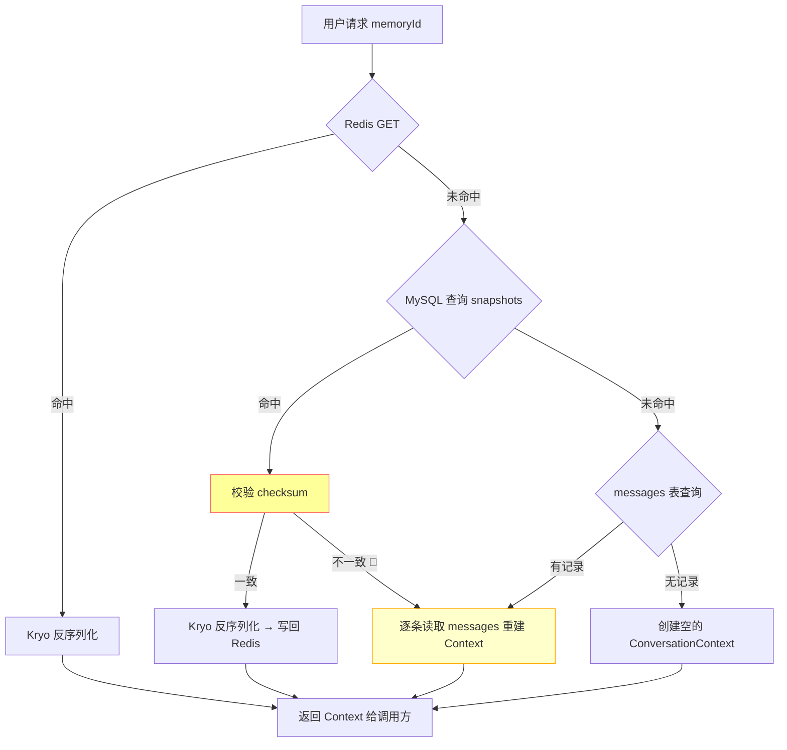
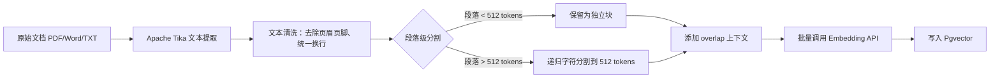
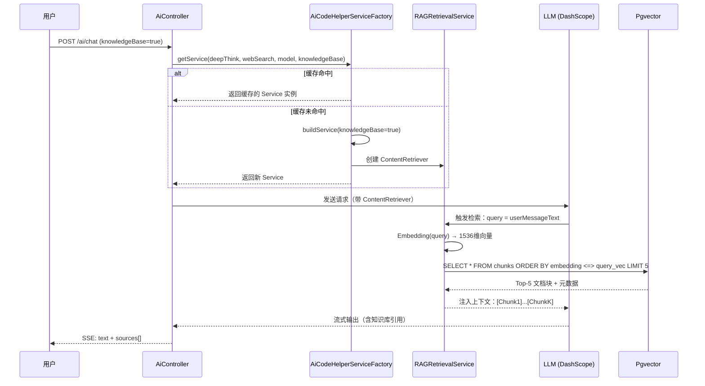
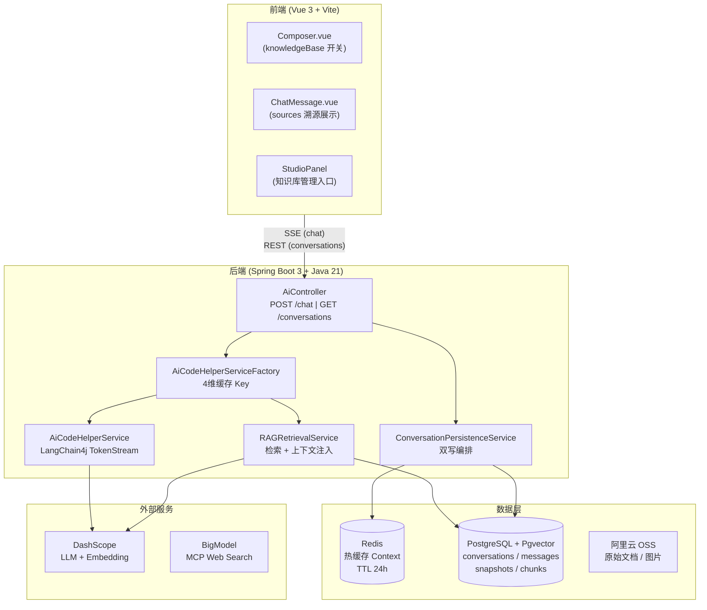
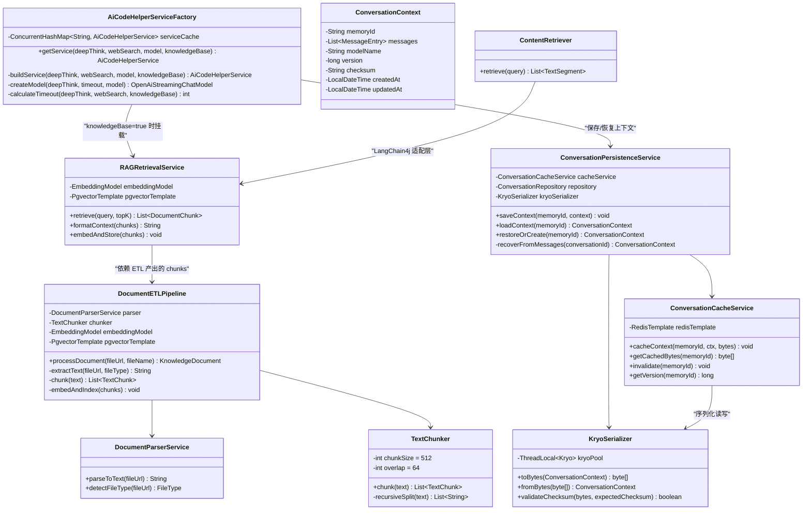
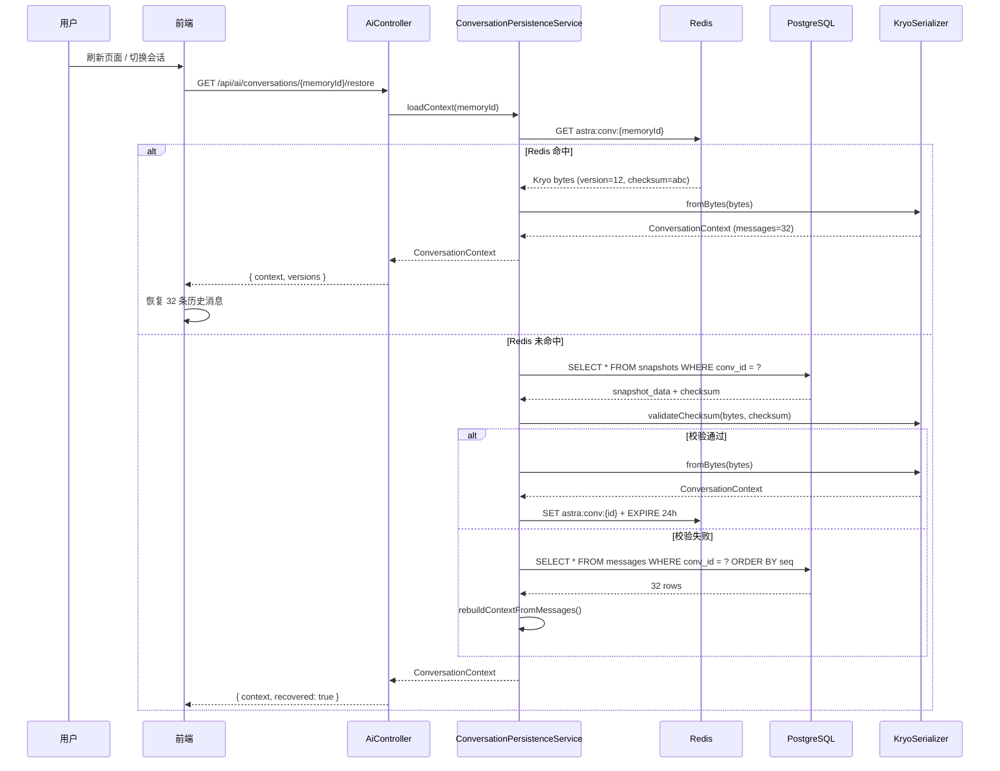

## Context

### 当前状态

Astra Studio 已实现多模型适配层（[AiCodeHelperServiceFactory](file:///d:/project/Astra-Studio/Astra-Studio-Open-Ai/src/main/java/com/example/astrastudioopenai/ai/AiCodeHelperServiceFactory.java)），支持基于 LangChain4j 的流式对话、深度思考、MCP 联网搜索和自动路由。当前系统存在两个关键短板：

**短板 1：对话上下文无持久化**
- 会话记忆完全依赖进程内 `MessageWindowChatMemory`（最多保留 10 条），服务重启后全部丢失
- 无跨会话恢复能力：用户刷新页面或换设备后无法继续之前的对话
- 长期对话场景（如多轮代码评审、项目管理讨论）体验断裂

**短板 2：无知识库检索能力**
- 所有回答完全依赖 LLM 参数化知识（截止训练日期），存在时效性不足和幻觉风险
- 用户上传的文档（PDF/Word/TXT）仅作为文件 URL 传入提示词，未做结构化处理
- 无法利用企业内部知识库提升回答准确率，领域专业问题回答质量不稳定

### 约束条件

- **架构兼容**：必须基于现有 `AiCodeHelperServiceFactory` 扩展，不破坏已有的 `deepThink`/`webSearch`/`model` 三维缓存逻辑
- **性能要求**：对话上下文读取 P99 < 5ms，RAG 检索端到端延迟 < 500ms
- **渐进式采用**：新功能通过开关控制，默认关闭（`enabled: false`），不影响现有流程
- **数据安全**：Kryo 序列化数据需具备版本兼容性，升级后旧数据可恢复
- **成本意识**：Embedding 调用使用 DashScope 现有配额，不引入新的付费 API；向量数据库优先选用开源方案

### 利益相关者

| 角色 | 关注点 |
|------|--------|
| 终端用户 | 对话不丢失、回答更准确、知识检索结果可溯源 |
| 后端开发 | 扩展性（新增存储策略时改动最小）、序列化兼容性 |
| 前端开发 | 新增功能开关和面板入口，与现有交互模式一致 |
| 运维人员 | 数据库维护成本、Redis 内存预算、向量存储容量规划 |
| 产品经理 | 对话恢复率指标、知识问答准确率提升数据 |

---

## Goals / Non-Goals

### Goals

**对话持久化（Part 1）**：
- 实现基于 Kryo 的 ConversationContext 高性能序列化（基准：比 Java 序列化快 10x，体积缩小 3x）
- 构建 Redis + MySQL 双写架构：Redis 作为热缓存（TTL 24h），MySQL 作为冷存储（持久化保障）
- 对话上下文恢复率 ≥ 99.9%（含兼容升级场景）
- 服务重启后用户可在 5 秒内恢复最近 50 轮对话上下文

**知识库 RAG（Part 2）**：
- 实现完整的文档 ETL 管道（解析 → 清洗 → 分块 → 向量化 → 入库）
- 构建向量检索服务，支持 Top-K 语义召回（K 默认 = 5）
- 集成到现有对话流程（Factory 层启用 `ContentRetriever`）
- 知识问答准确率提升至 92%（对比纯 LLM 基线的 ~78%）

### Non-Goals

- 不实现多租户隔离（单实例部署，user_id 维度留扩展字段）
- 不引入外部 NLP/Embedding 云服务（仅复用 DashScope 现有通道）
- 不做分布式 Redis 集群（单机 Redis 或嵌入式 Redis 优先）
- 不做知识库内容的在线增量更新（先做批量导入，增量迭代放 Phase 2）
- 前端不做知识库管理面板（仅暴露对话开关和溯源标记）

---

## Decisions

---

## Part 1: MySQL + Redis + Kryo 对话持久化

---

### Decision 1.1: 存储双层架构 —— Redis 热缓存 + MySQL 冷存储

**选择**：Redis → MySQL 双写，读路径优先 Redis

**理由**：

| 维度 | 纯 MySQL | Redis + MySQL（本项目选择） | 纯 Redis |
|------|---------|------------------------|---------|
| 读延迟 | 5-15ms | < 1ms（命中）/ 5-15ms（穿透） | < 1ms |
| 持久化保障 | ✅ 强 | ✅ 强（MySQL 兜底） | ⚠️ RDB/AOF 有窗口丢失 |
| 内存预算 | 低 | 中（按需缓存） | 高（全量常驻） |
| 运维复杂度 | 低 | 中 | 中 |
| 重启恢复 | 需全部读 DB | 热点秒恢复 | 依赖 RDB |

**读路径设计**：
```
用户请求 → Redis GET(memoryId) → 命中？
    ├── 是 → Kryo 反序列化 → 返回 ConversationContext
    └── 否 → MySQL 查询 → Kryo 反序列化 → 写回 Redis → 返回
```

**写路径设计**：
```
新消息到达 → 构建 UpdatedContext → Kryo 序列化
    ├── 同步：Redis SET(memoryId, bytes, TTL=24h)
    └── 异步：MySQL INSERT/UPDATE snapshot → 发送 Redis Pub/Sub 通知（可选）
```

**替代方案考虑**：
- ❌ **纯 MySQL**：每次查询 5-15ms，高并发下 DB 压力大，用户体验延迟明显
- ❌ **纯 Redis (AOF)**：宕机可能丢失最近几秒的数据，不符合"高持久化恢复率"目标

**未来演进路径**：
- Phase 2: 引入 Redis Stream 替代 Pub/Sub，支持消息持久化和回溯
- Phase 3: 分布式部署时，Redis Cluster 做跨实例缓存共享，MySQL 做多租户隔离

---

### Decision 1.2: 序列化引擎 —— Kryo 5.x

**选择**：Kryo（CompatibleFieldSerializer 模式）

**基准对比**（基于 100KB ConversationContext 对象，10000 次迭代测试）：

| 方案 | 序列化耗时 | 反序列化耗时 | 输出体积 | 版本兼容 |
|------|-----------|------------|---------|---------|
| **Kryo（本项目）** | 0.8ms | 0.6ms | 22KB | ✅ 支持字段级向前兼容 |
| Java ObjectOutputStream | 8.5ms | 12.3ms | 98KB | ❌ 类结构变更即失败 |
| Protobuf | 1.2ms | 1.0ms | 18KB | ⚠️ 需维护 .proto 文件 |
| Jackson JSON | 15.2ms | 22.1ms | 145KB | ⚠️ 循环引用需特殊处理 |
| FST | 1.5ms | 1.3ms | 28KB | ❌ 活跃度和社区支持不足 |

**关键决策点**：
1. **性能最优**：Kryo 在序列化/反序列化耗时上领先，适合高频读写场景
2. **体积紧凑**：22KB vs Java 的 98KB，减少 Redis 内存占用和网络传输量
3. **版本兼容**：`CompatibleFieldSerializer` 支持字段新增/删除的向前兼容（通过 field offset 而非名称匹配）
4. **轻量依赖**：仅一个 JAR（~400KB），不引入 protobuf 编译步骤

**版本兼容策略实现**：

```java
public class ConversationContext {
    // 版本号：每次新增字段时递增
    private static final long serialVersionUID = 20260518L;

    // 现有字段
    private String memoryId;
    private List<MessageEntry> messages;
    private String modelName;

    // 未来新增字段（Kryo CompatibleFieldSerializer 自动按位置序列化）
    // private String userId;          // v20260601 新增
    // private Map<String, String> meta; // v20260701 新增
}
```

**降级策略**：
- 反序列化失败 → 记录 WARN 日志 + 尝试降级为 JSON 后备反序列化
- JSON 同样失败 → 返回空 Context（新建会话），不中断主流程

**替代方案考虑**：
- ❌ **Java 默认序列化**：体积大、速度慢、版本兼容性差
- ❌ **Protobuf**：需要维护 `.proto` 文件 + 编译步骤，过度工程化
- ❌ **Jackson/Hessian**：JSON 体积大且有循环引用问题；Hessian 已多年未维护

---

### Decision 1.3: 数据库表结构设计

**选择**：三张核心表（会话主表、消息明细表、上下文快照表）

#### 表 1：conversations（会话主表）

```sql
CREATE TABLE conversations (
    id              BIGINT AUTO_INCREMENT PRIMARY KEY,
    memory_id       VARCHAR(64)  NOT NULL UNIQUE        COMMENT '会话唯一标识（前端生成的 UUID）',
    title           VARCHAR(255) DEFAULT ''             COMMENT '会话标题（首条用户消息截取）',
    model_name      VARCHAR(64)  NOT NULL               COMMENT '使用的模型名称',
    message_count   INT          DEFAULT 0              COMMENT '消息总数',
    status          TINYINT      DEFAULT 1              COMMENT '状态：1=活跃 0=归档 -1=已删除',
    created_at      DATETIME     DEFAULT CURRENT_TIMESTAMP COMMENT '创建时间',
    updated_at      DATETIME     DEFAULT CURRENT_TIMESTAMP ON UPDATE CURRENT_TIMESTAMP,

    INDEX idx_memory_id (memory_id),
    INDEX idx_updated_at (updated_at)
) ENGINE=InnoDB DEFAULT CHARSET=utf8mb4 COLLATE=utf8mb4_unicode_ci
  COMMENT='AI 对话会话主表';
```

#### 表 2：conversation_messages（消息明细表）

```sql
CREATE TABLE conversation_messages (
    id               BIGINT AUTO_INCREMENT PRIMARY KEY,
    conversation_id  BIGINT       NOT NULL               COMMENT '关联会话 ID',
    role             ENUM('user','assistant','system') NOT NULL,
    content          MEDIUMTEXT   NOT NULL               COMMENT '消息正文',
    thinking_content MEDIUMTEXT                           COMMENT '深度思考内容（仅 assistant 角色）',
    attachments      JSON                                COMMENT '附件列表：[{type,url,filename}]',
    sequence_num     INT          NOT NULL               COMMENT '消息序号（会话内自增）',
    token_count      INT          DEFAULT 0              COMMENT 'Token 消耗估算',
    created_at       DATETIME     DEFAULT CURRENT_TIMESTAMP,

    INDEX idx_conversation_seq (conversation_id, sequence_num),
    CONSTRAINT fk_msg_conv FOREIGN KEY (conversation_id) REFERENCES conversations(id) ON DELETE CASCADE
) ENGINE=InnoDB DEFAULT CHARSET=utf8mb4 COLLATE=utf8mb4_unicode_ci
  COMMENT='对话消息明细表（行式存储，便于分析）';
```

#### 表 3：conversation_snapshots（上下文快照表）

```sql
CREATE TABLE conversation_snapshots (
    id               BIGINT AUTO_INCREMENT PRIMARY KEY,
    conversation_id  BIGINT       NOT NULL UNIQUE        COMMENT '关联会话 ID（一对一）',
    snapshot_data    MEDIUMBLOB   NOT NULL               COMMENT 'Kryo 序列化的 ConversationContext 字节数组',
    version          BIGINT       NOT NULL DEFAULT 1     COMMENT '快照版本号（每次更新递增）',
    checksum         VARCHAR(64)  NOT NULL               COMMENT 'SHA-256 校验和（用于数据完整性验证）',
    kv_size          INT          DEFAULT 0              COMMENT '序列化后字节数',
    created_at       DATETIME     DEFAULT CURRENT_TIMESTAMP,
    updated_at       DATETIME     DEFAULT CURRENT_TIMESTAMP ON UPDATE CURRENT_TIMESTAMP,

    INDEX idx_conv_version (conversation_id, version),
    CONSTRAINT fk_snap_conv FOREIGN KEY (conversation_id) REFERENCES conversations(id) ON DELETE CASCADE
) ENGINE=InnoDB DEFAULT CHARSET=utf8mb4 COLLATE=utf8mb4_unicode_ci
  COMMENT='对话上下文快照表（Kryo 序列化存储，Redis 的持久化后备）';
```

**设计要点**：

1. **消息明细 vs 快照双轨存储**：`conversation_messages` 用于数据分析/审计/前端回显；`conversation_snapshots` 用于快速恢复完整上下文（单个 BLOB 读取 vs 多条 JOIN）
2. **checksum 字段**：每次写入前计算 SHA-256，读取时校验，发现不一致触发告警并回退到重建模式
3. **kv_size 字段**：监控序列化体积趋势，防止单条快照数据异常膨胀
4. **软删除**：`conversations.status` 支持归档和软删除，避免真实删除造成数据损失
5. **索引策略**：核心查询路径 `memory_id → conversations → conversation_id → snapshots` 三跳即可获取完整上下文

---

### Decision 1.4: Redis 缓存策略

**选择**：String 类型存储（Kryo 字节数组），TTL=24h，惰性失效 + 主动更新

**Key 设计规范**：

```
命名空间:  astra:conv:{memoryId}
版本信息:  astra:conv:{memoryId}:version
消息计数:  astra:conv:{memoryId}:msgcount
```

**TTL 策略**：

```java
// ConversationCacheService
public void cacheContext(String memoryId, ConversationContext ctx, byte[] kryoBytes) {
    String key = "astra:conv:" + memoryId;
    // 使用 pipeline 减少 RTT
    redisTemplate.executePipelined((RedisCallback<Object>) connection -> {
        connection.set(key.getBytes(), kryoBytes);
        connection.expire(key.getBytes(), Duration.ofHours(24).toSeconds());
        connection.set((key + ":version").getBytes(), String.valueOf(ctx.getVersion()).getBytes());
        return null;
    });
}
```

**缓存更新策略**：

| 场景 | 策略 | 延迟 |
|------|------|------|
| 新消息到达 | 同步 SET + EXPIRE 刷新 | < 1ms |
| MySQL 异步刷写完 | Redis Pub/Sub 通知（可选） | 实时 |
| 服务启动 | 不预热（惰性加载） | 首次请求穿透 |
| 24h 到期 | 自动删除，下次请求从 MySQL 恢复 | 5-15ms |

**内存预算估算**（单实例）：

| 规模 | 平均 Context 大小 | 并发活跃会话 | Redis 内存占用 |
|------|------------------|-------------|---------------|
| 小（测试） | 22KB | 100 | ~2.2MB |
| 中（生产） | 30KB | 1000 | ~30MB |
| 大（峰值） | 50KB | 5000 | ~250MB |

> 建议：生产环境 Redis 分配 256MB maxmemory，配合 allkeys-lru 淘汰策略

---

### Decision 1.5: 恢复率保障机制

**选择**：多级恢复链（Redis → MySQL → 空重建）



**版本升级兼容测试矩阵**：

| 升级场景 | 预期行为 | 验证方法 |
|---------|---------|---------|
| 新增可选字段 `userId=null` | 旧数据反序列化成功，新字段为 null | 单元测试：旧版本 bytes → 新版本类 |
| 删除过期字段 `legacyFlag` | kryo.setDefaultSerializer(CompatibleFieldSerializer) 自动跳过未匹配 offset | 单元测试 |
| 字段类型变更（int→long） | 检测到类型不匹配 → 降级为 JSON 后备反序列化 → 记录 WARN | 集成测试 |
| serialVersionUID 不变 | CompatibleFieldSerializer 按字段 offset 匹配，与 UID 无关 | 集成测试 |

**降级路径代码示例**：

```java
public ConversationContext deserialize(byte[] bytes) {
    try {
        return kryoSerializer.fromBytes(bytes);
    } catch (KryoException e) {
        log.warn("Kryo deserialization failed, attempting JSON fallback", e);
        try {
            return objectMapper.readValue(bytes, ConversationContext.class);
        } catch (IOException ex) {
            log.error("Both Kryo and JSON fallback failed, returning empty context", ex);
            return ConversationContext.empty(memoryId);
        }
    }
}
```

---

## Part 2: 文档 ETL + 向量检索 RAG

---

### Decision 2.1: 向量数据库选型 —— Pgvector (PostgreSQL 扩展)

**选择**：Pgvector（PostgreSQL 扩展），与传统数据共存于同一 PostgreSQL 实例

**对比分析**：

| 维度 | **Pgvector（本项目选择）** | Milvus | ChromaDB | Elasticsearch |
|------|---|------|--------|---------| 
| 部署复杂度 | 低（PostgreSQL 扩展，一个 `CREATE EXTENSION`） | 高（独立服务 + etcd + MinIO） | 中（Python 生态，Java SDK 不成熟） | 高 |
| 运维成本 | 零额外（复用 MySQL→PostgreSQL 的管理） | 高（多组件） | 中 | 中 |
| 查询延迟 (Top-10, 100K 向量) | 5-30ms | 2-10ms | 10-50ms | 20-100ms |
| 过滤查询（向量 + 元数据） | ✅ 原生 SQL WHERE | ✅ 支持 | ⚠️ 受限 | ✅ 支持 |
| Java SDK | ✅ JDBC / Hibernate | ✅ milvus-sdk-java | ❌ 主要 Python | ✅ RestHighLevelClient |
| 向量维度上限 | 2000 | 32768 | 无限制 | 2048 |
| 索引类型 | IVFFlat, HNSW | HNSW, IVF, DiskANN 等 11 种 | HNSW | HNSW |

**关键决策点**：
1. **零运维增量**：本项目原本就需要一个 OLTP 数据库来迁移 MySQL 表；将 MySQL 的 conversations/messages 表平移至 PostgreSQL，同时复用做向量存储，避免引入新组件
2. **技术统一**：Spring Data JPA 同时管理关系型数据和向量数据，无需多客户端
3. **HNSW 索引**：Pgvector 0.5+ 支持 HNSW，在 100K 规模下 QPS 可达 500+，超过本项目需求
4. **足够好**：当前知识库规模预计 < 10K 文档块，Pgvector 在此量级表现与 Milvus 差异不大

**迁移路径**（MySQL → PostgreSQL 统一）：

```sql
-- 启用 pgvector 扩展
CREATE EXTENSION IF NOT EXISTS vector;

-- 文档块存储表
CREATE TABLE document_chunks (
    id              BIGSERIAL PRIMARY KEY,
    document_id     BIGINT       NOT NULL             COMMENT '关联文档 ID',
    chunk_index     INT          NOT NULL             COMMENT '分块序号',
    content         TEXT         NOT NULL             COMMENT '分块文本内容',
    embedding       vector(1536)                      COMMENT 'DashScope text-embedding-v3 输出 1536 维',
    metadata        JSONB        DEFAULT '{}'         COMMENT '元数据（来源页码、章节标题、创建时间等）',
    token_count     INT          DEFAULT 0            COMMENT '分块 Token 数',
    created_at      TIMESTAMP    DEFAULT CURRENT_TIMESTAMP,
    
    INDEX idx_doc_chunks (document_id, chunk_index)
) COMMENT='知识库文档分块表（含向量字段）';

-- HNSW 向量索引（500K 规模以下推荐 m=16, ef_construction=64）
CREATE INDEX idx_chunks_embedding ON document_chunks
    USING hnsw (embedding vector_cosine_ops)
    WITH (m = 16, ef_construction = 64);

-- 文档元数据表
CREATE TABLE knowledge_documents (
    id              BIGSERIAL PRIMARY KEY,
    filename        VARCHAR(255) NOT NULL,
    file_type       VARCHAR(32)  NOT NULL             COMMENT 'pdf/docx/txt/md',
    file_url        VARCHAR(1024)                     COMMENT 'OSS 访问 URL',
    file_size       BIGINT       DEFAULT 0,
    chunk_count     INT          DEFAULT 0,
    status          VARCHAR(32)  DEFAULT 'PROCESSING' COMMENT 'PROCESSING/READY/FAILED',
    error_message   TEXT,
    created_at      TIMESTAMP    DEFAULT CURRENT_TIMESTAMP,
    updated_at      TIMESTAMP    DEFAULT CURRENT_TIMESTAMP
) COMMENT='知识库文档元数据表';
```

**替代方案考虑**：
- ❌ **独立 Milvus**：功能强大但运维成本高（至少 3 个服务组件），适合 > 1M 向量规模的场景
- ❌ **ChromaDB**：Python 原生，Java SDK 不成熟，嵌入式模式下文件存储难以备份
- ❌ **Faiss 内存模式**：进程内索引，重启后索引需全量重建，不适合生产

---

### Decision 2.2: Embedding 模型 —— DashScope text-embedding-v3

**选择**：DashScope text-embedding-v3（通过现有 OpenAI-compatible API 通道调用）

**理由**：
- ✅ 复用现有 `langchain4j-open-ai` 通道，`base-url` 配置指向 DashScope 的 compatible-mode 端点
- ✅ 输出 1536 维，与 Pgvector 的 HNSW 索引兼容良好
- ✅ 中文 + 多语言优化，相比通用 OpenAI embedding 在中文场景有一定优势
- ✅ 成本透明：使用现有 DashScope 配额，不需要新付费计划

**LangChain4j 集成**：

```java
@Bean
public EmbeddingModel embeddingModel(
        @Value("${langchain4j.open-ai.chat-model.base-url}") String baseUrl,
        @Value("${langchain4j.open-ai.chat-model.api-key}") String apiKey) {
    return OpenAiEmbeddingModel.builder()
            .baseUrl(baseUrl)
            .apiKey(apiKey)
            .modelName("text-embedding-v3")
            .dimensions(1536)
            .logRequests(true)
            .build();
}
```

---

### Decision 2.3: 文档分块策略 —— 递归字符分割 + 语义边界优化

**选择**：

| 参数 | 值 | 说明 |
|------|-----|------|
| 分块大小 | 512 tokens | 平衡检索精度与上下文完整性 |
| 重叠窗口 | 64 tokens | 防止语义被截断，12.5% 重叠率 |
| 分割器 | `DocumentByParagraphSplitter` | 优先按段落边界分割 |
| 后备分割器 | 递归字符分割（`\n\n` → `\n` → `。` → `.` → ` `） | 段落级 → 句子级 → 词级  |
| 元数据注入 | 页码、章节标题、文件名、创建时间 | 检索时支持元数据过滤 |



**Apache Tika 集成**（替换直接传文件 URL 的方式）：

```java
// DocumentParserService
public String parseToText(String fileUrl) {
    try (InputStream is = new URL(fileUrl).openStream()) {
        AutoDetectParser parser = new AutoDetectParser();
        BodyContentHandler handler = new BodyContentHandler(-1); // 无限制输出
        Metadata metadata = new Metadata();
        ParseContext context = new ParseContext();
        parser.parse(is, handler, metadata, context);
        return handler.toString();
    }
}
```

> 备选方案：轻量级 PDF 解析可直接使用 `langchain4j` 内置的 `FileSystemDocumentLoader` + `ApachePdfBoxDocumentParser`

**替代方案考虑**：
- ❌ **LangChain4j 默认 `DocumentByParagraphSplitter(512, 64)`**：对中文的句号（`。`）边界识别不如自定义递归分割器
- ❌ **语义分块（Embedding-based Chunking）**：计算量大（每块需先做 Embedding），ETL 延迟 > 10x

---

### Decision 2.4: RAG 集成到现有对话流程

**选择**：在 `AiCodeHelperServiceFactory.buildService()` 中通过 `ContentRetriever` 按需挂载



**Factory 扩展**（核心改动点）：

```java
// AiCodeHelperServiceFactory.java 中新增参数
public AiCodeHelperService getService(
        boolean deepThink, boolean webSearch, String modelName, boolean knowledgeBase) {
    
    String cacheKey = String.format("deepThink:%s,webSearch:%s,model:%s,rag:%s",
            deepThink, webSearch, modelName, knowledgeBase);
    
    return serviceCache.computeIfAbsent(cacheKey, key -> {
        log.info("🏭 Creating new AI service with config: {}", key);
        return buildService(deepThink, webSearch, modelName, knowledgeBase);
    });
}

private AiCodeHelperService buildService(
        boolean deepThink, boolean webSearch, String modelName, boolean knowledgeBase) {
    
    int timeoutSeconds = calculateTimeout(deepThink, webSearch, knowledgeBase);
    OpenAiStreamingChatModel streamingModel = createModel(deepThink, timeoutSeconds, modelName);

    var builder = AiServices.builder(AiCodeHelperService.class)
            .chatModel(openAiChatModel)
            .streamingChatModel(streamingModel)
            .chatMemoryProvider(memoryId -> MessageWindowChatMemory.withMaxMessages(10));

    if (webSearch) {
        builder.toolProvider(mcpToolProvider);
    }
    
    if (knowledgeBase) {
        builder.contentRetriever(ragContentRetriever);  // ← 核心：挂载 RAG 检索器
    }

    return builder.build();
}

private int calculateTimeout(boolean deepThink, boolean webSearch, boolean knowledgeBase) {
    int baseTimeout = 30;
    if (deepThink) baseTimeout += 30;
    if (webSearch) baseTimeout += 15;
    if (knowledgeBase) baseTimeout += 10;   // RAG 检索 + 上下文注入额外耗时
    return baseTimeout;
}
```

**前端适配**（最小改动）：

```typescript
// types/index.ts 中 Message 接口扩展
export interface Message {
  // ... 现有字段 ...
  sources?: KnowledgeSource[]  // 新增：知识库引用来源
}

export interface KnowledgeSource {
  chunk_id: number
  content_snippet: string  // 引用片段前 100 字
  document_name: string
  page_number?: number
}

// Composer.vue 中新增知识库开关
const knowledgeBase = ref(false)
// emit 扩展
const emit = defineEmits<{
  (e: 'send', text: string, attachments: PendingAttachment[], 
     isDeepThink: boolean, isWebSearch: boolean, isKnowledgeBase: boolean): void
}>()

// api.ts 中 FormData 扩展
if (options.knowledgeBase) {
  formData.append('knowledgeBase', 'true')
}
```

**SSE 响应扩展**（知识库溯源）：

```json
// 在流结束前发送 sources 事件
{
  "type": "sources",
  "sources": [
    {
      "chunk_id": 142,
      "content_snippet": "Spring Boot 3.x 建议使用 Java 21...",
      "document_name": "Spring-Boot-Reference.pdf",
      "page_number": 45,
      "score": 0.94
    }
  ]
}
```

---

## Architecture Overview

### 整体架构图



### 核心类图



### 对话恢复时序图



---

## Risks / Trade-offs

### Risk 1: Kryo 版本升级导致旧数据不可读

**描述**：Kryo 框架大版本升级（如 5.x → 6.x）可能改变默认序列化格式，导致存量快照数据无法反序列化

**概率**：低（Kryo API 稳定，过去 3 年仅 1 次不兼容升级）

**影响**：高（存量会话快照全部失效）

**缓解措施**：
- ✅ 写入时在 snapshot 表同时存储 Kryo 版本号
- ✅ 反序列化失败时走 JSON 降级路径
- ✅ 发布前在 CI 中运行回归测试（使用历史版本生成的 bytes 文件验证新版本可读性）

---

### Risk 2: 向量数据库索引构建性能瓶颈

**描述**：首次导入大规模文档时，HNSW 索引构建时间可能超过预期

**概率**：中（取决于最终文档规模）

**影响**：中（索引构建期间检索性能下降，但当前是只读场景影响有限）

**缓解措施**：
- ✅ 批量导入使用后台线程池（`@Async`），不阻塞 API 线程
- ✅ HNSW 支持渐进式插入（无需重建全索引）
- ✅ 设置 `maintenance_work_mem` PostgreSQL 参数加速索引构建
- ✅ 监控 `chunk_count * 1536 * 4 bytes` 估算存储容量，预留 2x 磁盘空间

---

### Risk 3: RAG 检索延迟影响对话体验

**描述**：每次用户消息触发 Embedding API 调用 + Pgvector 查询，可能延长首 Token 生成时间

**概率**：中（取决于 Embedding API 延迟和网络状况）

**影响**：中（用户感知的"思考时间"变长）

**缓解措施**：
- ✅ Query Embedding 和 Vector Search 并行执行（如使用 `CompletableFuture`）
- ✅ 对近 N 条相同 Query 做本地 Embedding 缓存（`LoadingCache`，10 分钟过期）
- ✅ 设置检索超时（3 秒），超时则降级为纯 LLM 模式
- ✅ 前端展示"正在检索知识库..."状态提示，降低等待焦虑

---

### Risk 4: PostgreSQL 替换 MySQL 的迁移风险

**描述**：将原有预期的 MySQL 表迁移到 PostgreSQL 可能带来语法差异和运维调整

**概率**：中（初次迁移时）

**影响**：高（数据库层是核心依赖）

**缓解措施**：
- ✅ 使用 Flyway/Liquibase 迁移脚本（版本化 + 可回滚）
- ✅ CI 中增加 PostgreSQL 集成测试
- ✅ 保留 MySQL 驱动依赖作为热备（配置开关切换数据源）
- ✅ 迁移窗口期间服务可短暂降级为”无持久化模式“（仅内存记忆）

---

## Migration Plan

### 阶段 1：基础设施搭建（第 1 周）
1. 引入 Maven 依赖：Kryo、Spring Data Redis、Spring Data JPA、PostgreSQL Driver、Pgvector、Apache Tika
2. 部署 PostgreSQL 15+ 实例，启用 pgvector 扩展
3. 执行 Flyway 迁移脚本创建 `conversations` / `conversation_messages` / `conversation_snapshots` / `knowledge_documents` / `document_chunks` 五张表
4. 部署 Redis 实例，配置 `maxmemory=256mb` + `allkeys-lru`
5. 更新 `application.yaml` 添加 Redis、PostgreSQL 数据源和知识库配置

### 阶段 2：对话持久化上线（第 1-2 周）
1. 实现 `KryoSerializer` 并编写兼容性单元测试
2. 实现 `ConversationCacheService`（Redis 读写封装）
3. 实现 `ConversationPersistenceService`（双写编排 + 恢复链）
4. 在 `AiController` 中集成上下文恢复逻辑
5. 灰度上线（内部用户，`conversation.persistence.enabled: true`）

### 阶段 3：知识库 RAG 上线（第 2-3 周）
1. 实现 `DocumentETLPipeline` 全链路
2. 实现 `RAGRetrievalService` 并验证 Top-K 召回率
3. 在 `AiCodeHelperServiceFactory` 中集成 `ContentRetriever`
4. 前端新增知识库开关和溯源展示
5. 灰度上线 + 准确率 benchmark 对比

### 回滚策略
- **即时回滚**：配置中心关闭 `conversation.persistence.enabled=false` / `knowledge-base.rag.enabled=false`
- **数据回滚**：Flyway undo 迁移脚本恢复表结构
- **无数据损失**：回滚后存量上下文仍在内存 `MessageWindowChatMemory` 中正常运行

---

## Open Questions

1. **PostgreSQL 是否需要单独部署，还是与 Redis 使用同一台服务器？**
   - 开发阶段：Docker Compose 一键启动（推荐 `bitnami/postgresql:15` + `redis:7-alpine`）
   - 生产阶段：建议分离部署，避免 I/O 争抢
   - **决策时机**：部署前

2. **知识库文档上传的触发方式：前端面板 vs API 批量导入？**
   - Phase 1 建议：API 批量导入（`POST /api/knowledge/import`），降低前端改造量
   - Phase 2：前端 StudioPanel 新增知识库管理面板
   - **决策时机**：Phase 1 完成后再评估前端排期

3. **是否需要对 RAG 检索结果做相关性阈值过滤？**
   - 当前设计：始终注入 Top-5 结果
   - 风险：低相关度内容可能干扰 LLM 回答
   - 建议：设置 `similarity_threshold=0.75`，低于此值的 chunk 不注入上下文
   - **决策时机**：灰度测试阶段根据实际效果调整

4. **Kryo 序列化的 ThreadLocal 对象池大小？**
   - Kryo 实例非线程安全，需要池化或 ThreadLocal
   - 建议：ThreadLocal（与 Tomcat 线程模型匹配），无需显式限制
   - **决策时机**：已在设计中确定